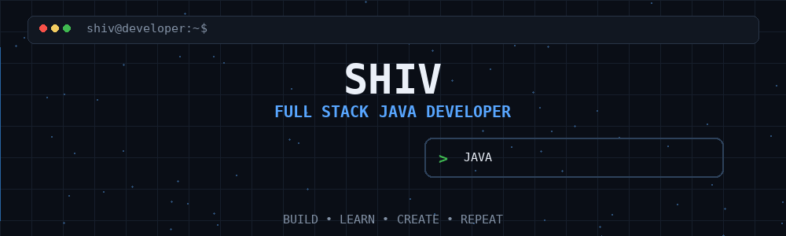

  

# 💫 About Me:
👋 Hey, I'm Shiv 💻 Full Stack Java Developer Building scalable backends, interactive applications, and practical software solutions.

## 🌐 Socials:
 

## 💻 Tech Stack

### 👨‍💻 Programming Languages

  

### 🌐 Frontend Development

  

### ☕ Java & Backend

  

**Spring Security • JWT • JPA • REST APIs**

### 🗄️ Databases & Cloud

  

### 🛠️ Tools & DevOps

  

### 🤖 AI / ML & Embedded

  

### 🎨 Design & 3D

  

# 📊 GitHub Stats:
 
 

<!-- Proudly created with GPRM ( https://gprm.itsvg.in ) -->
